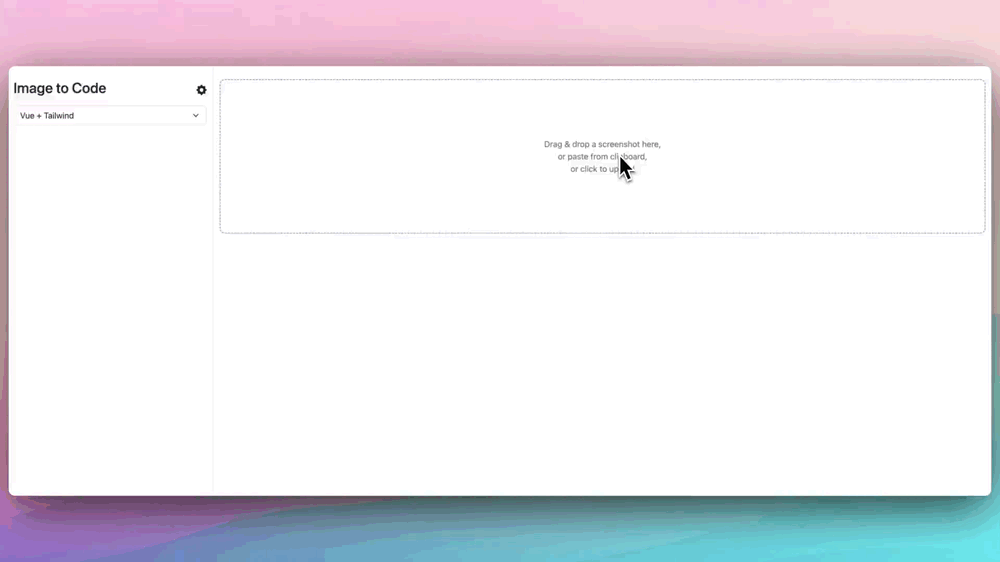
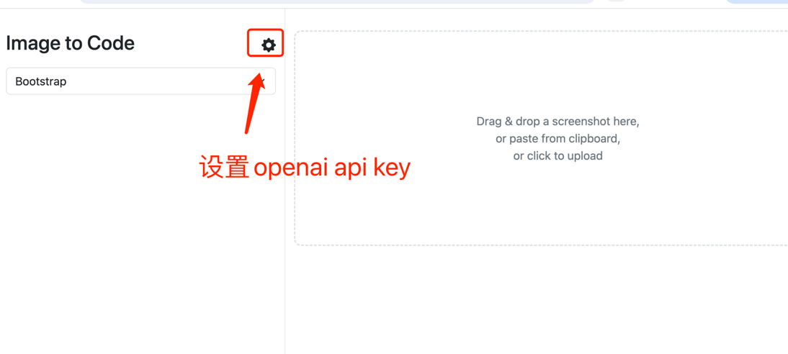
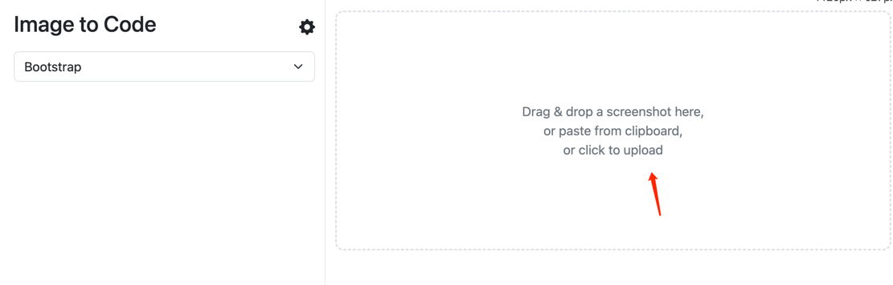

# image to code

## Introduction
PageBuilder can generate Html pages with the help of AI
- Text to page: Analyzes customer requirements based on the demand text and generates pages.
- Image to page: Converts images into pages.
It uses GPT-4 Vision to generate code.
## Demo



## Usage
### Online Experience

[http://image2code.itbuilder.cn:7008/text2page](http://image2code.itbuilder.cn:7008/text2page)

### Run Locally
```shell
mvn install
java -jar target/page-builder-1.0.0.jar
```
Visit
```
http://localhost:8080/text2page
```
### Set up OpenAI API key



Click settings to configure the OpenAI API key.
 **The API key needs to have access to GPT-4** 

### Upload Image

After uploading the image, GPT's Vision will recognize the image and generate code.